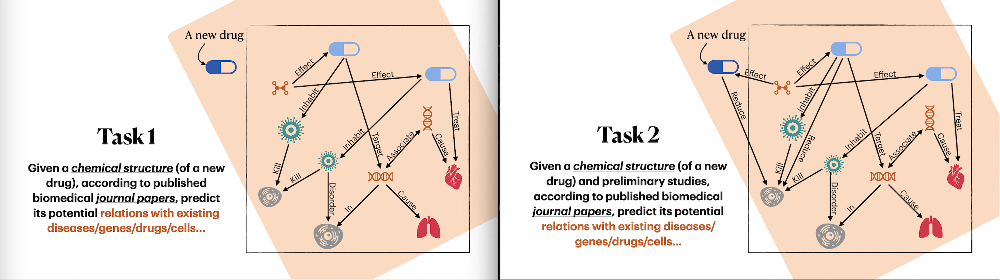

# DrugHunter

A dynamic knowledge graph embedding methods for new drug discovery.

### Reference
- A Paper collection: Deep Learning for Graphs in Chemistry and Biology [[GitRepo]](https://github.com/mufeili/DL4MolecularGraph)

-   Hamilton W, Ying Z, Leskovec J. "Inductive representation learning on large graphs." NIPS 2017. [[paper]](https://cs.stanford.edu/people/jure/pubs/graphsage-nips17.pdf)